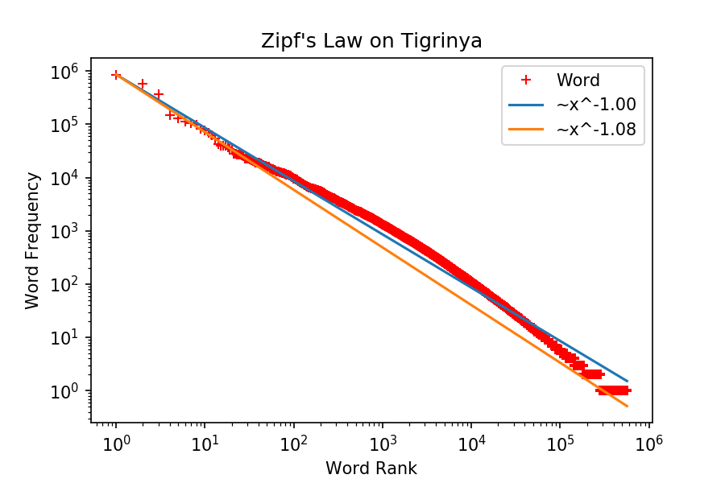

# Tigrinya Word Count

This is a compilation of over `1.15 million` unique Tigrinya words and their frequencies. The source documents were collected from various sources across the web, including newspapers, websites, blogs, books, magazines, etc.

The source documents were deduplicated and the text was preprocessed (normalized and tokenized) before generating the word count.
The statistics provided is believed to be a good representation of the language characteristics.

Due to Tigrinya's rich morphology, the vocabulary is expected to grow further as more text becomes available for analysis, and this repository will be updated, accordingly.

> From version 3.0.0 onwards, content from social media such as comments on YouTube is not included in the estimation. This is due to the very high ratio of noise observed in those texts.


## Content Format

 - File: `ti_word_count.txt`
 - Each line is formed as `<word>TAB<count>`


## Tigrinya Stop-words

A compilation of Tigrinya stop words can be found at `ti_stop_words.txt`.
These are manually curated functional words with over 10k frequency in the data sources.


## Statistics

 - Source tokens: 59,805,568
 - Vocabulary: 1,158,871
 - Stop words: 182
 - See the Tigrinya word frequency and ranking distribution 


## Uses

 - Distributed under the MIT License. It can be freely used for any purpose with proper attributions to the author.
 - If you use this resource in a published work, please cite as follows:

```
Fitsum Gaim, 2017, Tigrinya WordCount, https://github.com/fgaim/Tigrinya-WordCount
```
